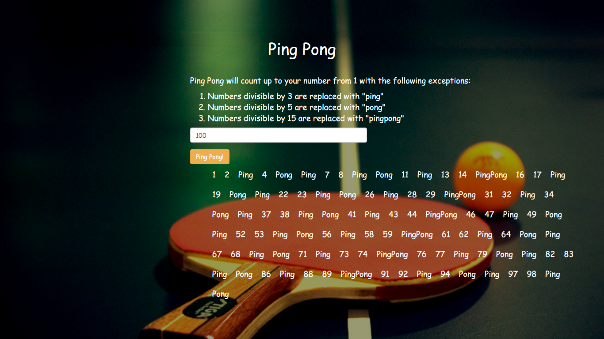

# Ping pong

Author: [Edward Mudaida](https://github.com/EdwardMudaid)

A web application that takes a number from a user and returns a range of numbers from 1 to the chosen number with the following exceptions:

[view on gh-pages](https://edwardmudaida.github.io/ping-pong/)
```
Numbers divisible by 3 are replaced with "ping"
Numbers divisible by 5 are replaced with "pong"
Numbers divisible by 15 are replaced with "pingpong"
```
Created using HTML, CSS, Bootstrap, JavaScript and jQuery.

A user should be able to enter a new number and see new results over and over again.



## Specifications

- It counts upto the specified number.
    - Example input: 2
    - Example output 1, 2

 - Numbers divisible by 3 are replaced with "ping"
    - Example input: 3
    - Example output 1, 2, ping

 - Numbers divisible by 5 are replaced with "pong"
    - Example input: 5
    - Example output 1, 2, Ping, 4, Pong

 - Numbers divisible by 15 are replaced with "pingpong"
    - Example input: 15
    - Example output 1, 2, Ping, 4, Pong, Ping, 7, 8, Ping, Pong, 11, Ping, 13, 14, Ping, Pong
    
 - Previous output is cleared before a new output is appended.

Running the project:
```
1. Clone the repo using git clone [URL]
```
```
2. Open index.html in a browser.
```
